<div align="center">


# Vehicle Dynamics Workbench

**평면 3자유도 차량 동역학 해석 · 표준 조종 안정성 시험 · 실시간 주행 시뮬레이터**<br>
서버도 설치도 필요 없이 브라우저에서 바로 동작하는 정적 웹 앱

<!-- generated:badges -->
<p align="center">
  <a href="LICENSE"></a>
  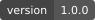
  <a href="docs/VALIDATION.md">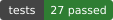</a>
  <a href="package.json">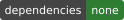</a>
  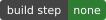
</p>
<p align="center">
  
  
  
  <a href="docs/MODEL.md">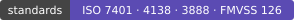</a>
</p>
<!-- /generated:badges -->

[실행 방법](#실행-방법) · [주요 기능](#주요-기능) · [화면](#화면) · [결과 예시](#결과-예시) · [벤치마크](#프리셋-벤치마크) · [모델](#모델-개요) · [검증](#검증) · [English](#english)

<br>

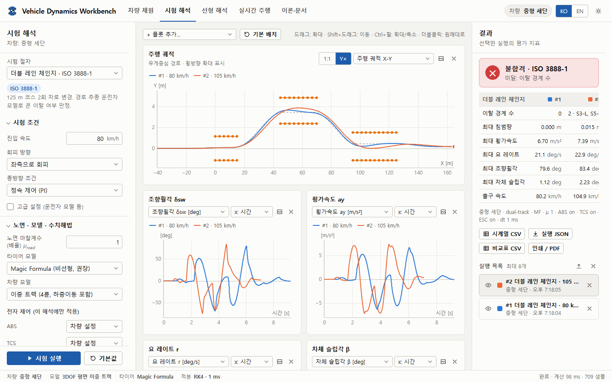

<sub>시험 해석 화면: ISO 3888-1 더블 레인 체인지를 80 km/h와 105 km/h로 실행해 비교</sub>

</div>

<br>

## 실행 방법

설치나 빌드가 필요 없습니다.

| 방법 | 절차 |
| --- | --- |
| **파일로 바로 열기** | `index.html`을 브라우저로 엽니다. `file://`에서도 동작합니다. |
| **로컬 서버** | 프로젝트 폴더에서 `python -m http.server 8000` 실행 후 `http://localhost:8000` 접속 |
| **GitHub Pages** | 저장소 Settings → Pages → *Deploy from a branch*에서 기본 브랜치의 `/ (root)` 선택 |

권장 브라우저는 최신 Chrome·Edge·Firefox·Safari입니다(수식 표시에 MathML Core 사용).

<details>
<summary><b>조작 방법</b></summary>

<br>

| 화면 | 입력 | 동작 |
| --- | --- | --- |
| 시험 해석 | <kbd>Ctrl</kbd> + <kbd>Enter</kbd> | 시험 실행 |
| 그래프 | 드래그 / <kbd>Shift</kbd> + 드래그 / 더블클릭 | 확대 / 이동 / 원래대로 |
| 실시간 주행 | <kbd>↑</kbd> <kbd>W</kbd> | 가속 (후진 중에는 제동) |
| | <kbd>↓</kbd> <kbd>S</kbd> | 제동, 정지 후 계속 누르면 후진 |
| | <kbd>←</kbd> <kbd>→</kbd> | 조향 (속도 감응 한계) |
| | <kbd>Space</kbd> | 주차 브레이크 (후륜) |
| | <kbd>R</kbd> · <kbd>P</kbd> · <kbd>C</kbd> | 초기화 · 일시정지 · 카메라 전환 |
| | <kbd>+</kbd> · <kbd>−</kbd> | 확대 · 축소 |
| | 게임패드 | 좌 스틱 조향, RT 가속, LT 제동, A 주차, Y 초기화 |

</details>

## 주요 기능

<div align="center">

**11** 표준 시험 &nbsp;·&nbsp; **46** 차량 매개변수 &nbsp;·&nbsp; **47** 출력 채널 &nbsp;·&nbsp; **27** 검증 항목 &nbsp;·&nbsp; **0** 외부 의존성

</div>

| 작업 공간 | 할 수 있는 일 |
| --- | --- |
| **차량 제원** | 매개변수 46개(단위·허용 범위·설명 포함), 프리셋 7종, 축척 개략도, 하중별 타이어 곡선, 파생 특성과 타당성 경고, JSON·MATLAB `.m` 내보내기 |
| **시험 해석** | 표준 시험 11종 수행·판정, 최대 8개 실행 비교, 매개변수 스윕, 선형 모델 겹쳐 보기, CSV·JSON·PNG·PDF 출력 |
| **선형 해석** | 정상상태 이득, Bode 선도, 근궤적, 고유진동수·감쇠비, 스텝 응답, 상태공간 행렬 |
| **실시간 주행** | 1 kHz 비선형 모델 주행, 키보드·게임패드·터치 입력, 시험 코스 6종, 타이어 상태·g-g 선도, 기록 후 해석으로 보내기 |
| **이론·문서** | 운동방정식부터 참고문헌까지 16개 절, MathML 수식, 한국어/영어 |

<details open>
<summary><b>표준 시험 절차 11종</b></summary>

<br>

| 시험 | 기준 | 주요 지표 |
| --- | --- | --- |
| 스텝 조향 | ISO 7401 | 정상 이득, 응답시간, 피크시간, 오버슈트, TB 계수 |
| 정현파 조향 | ISO 7401 | 이득·위상 및 선형 모델 비교 |
| 사인 위드 드웰 | FMVSS 126 / UN GTR 8 | 요 레이트 비(1.00 s, 1.75 s), 횡변위, 합격 판정 |
| 서서히 증가하는 조향 | NHTSA SIS | A(0.3 g 조향휠각), 언더스티어 구배 |
| 정상원 선회 | ISO 4138 | 조향 특성 선도, 언더스티어 구배, 한계 횡가속도 |
| 더블 레인 체인지 | ISO 3888-1 | 콘 경계 이탈 판정 |
| 장애물 회피 | ISO 3888-2 | 콘 경계 이탈 판정 |
| 슬라럼 | - | 콘 접촉, 통과 시간 |
| 직진 제동 (μ-split 포함) | ECE R13-H | 제동거리, MFDD, 요 편차 |
| 발진 가속 | - | 0~100 km/h, 견인 한계 |
| 사용자 조향 입력 | - | 실측 조향 CSV 재현 |

</details>

## 화면

<table>
<tr>
<td width="50%" align="center">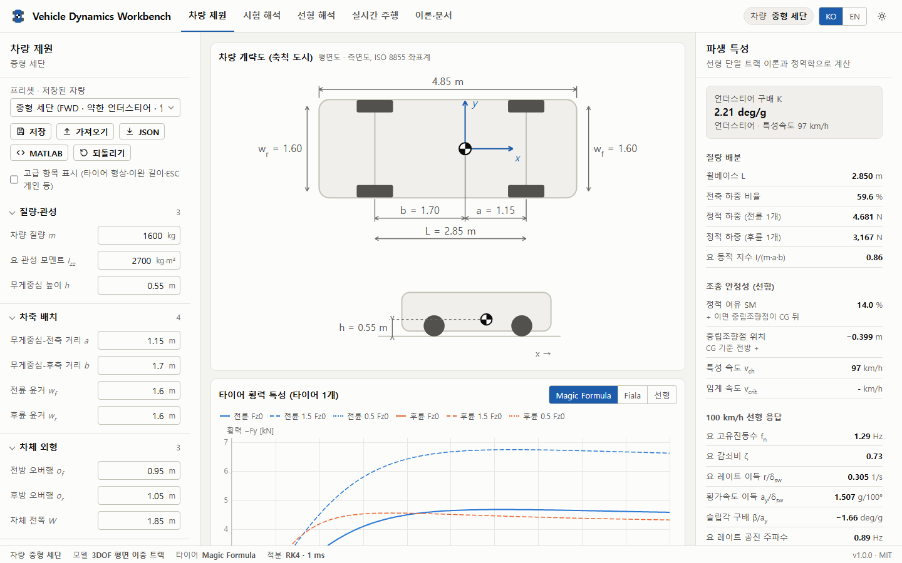<br><sub><b>차량 제원</b>: 매개변수, 축척 개략도, 타이어 곡선, 파생 특성</sub></td>
<td width="50%" align="center">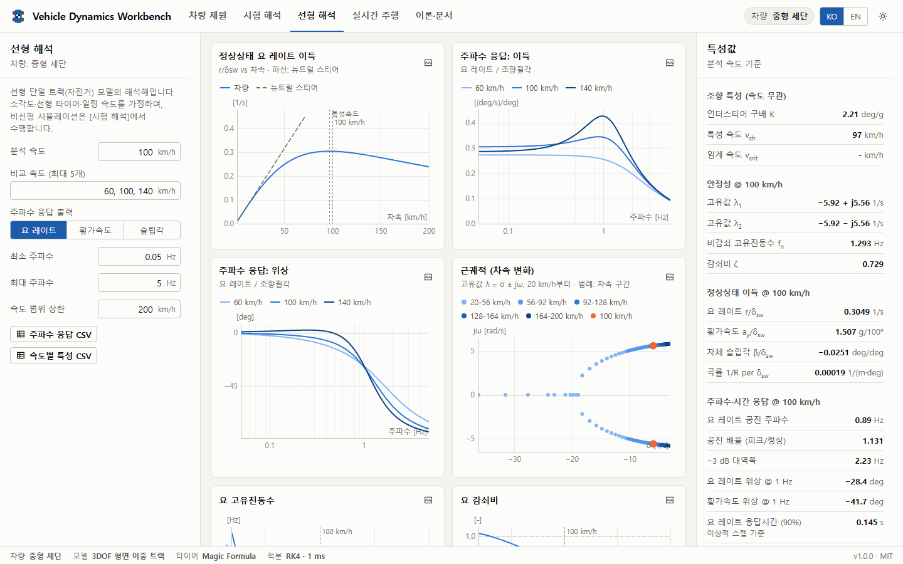<br><sub><b>선형 해석</b>: 이득, Bode 선도, 근궤적, 특성값</sub></td>
</tr>
<tr>
<td align="center">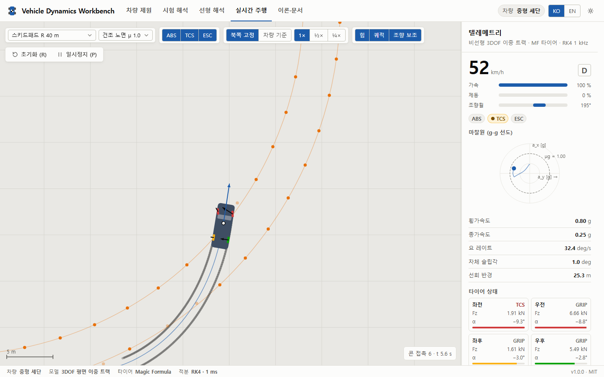<br><sub><b>실시간 주행</b>: 스키드패드 선회, 타이어 상태와 g-g 선도</sub></td>
<td align="center">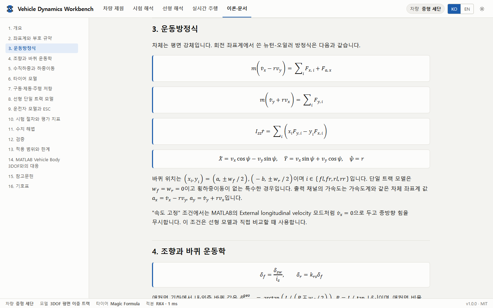<br><sub><b>이론·문서</b>: 운동방정식과 가정, MathML 수식</sub></td>
</tr>
</table>

## 결과 예시

아래 그래프는 앱과 같은 물리 코어로 계산했으며, `npm run docs`로 다시 생성됩니다. GitHub의 라이트/다크 테마에 맞춰 자동으로 바뀝니다.

<table>
<tr>
<td width="50%" align="center">
<picture>
  <source media="(prefers-color-scheme: dark)" srcset="docs/figures/step-dark.svg">
  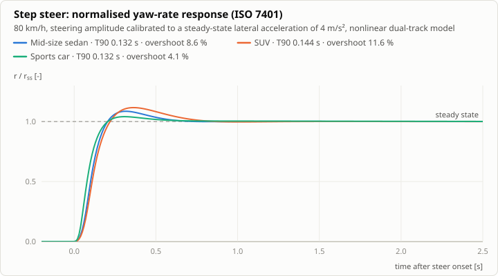
</picture>
<sub><b>스텝 조향 (ISO 7401)</b><br>차종별 요 레이트 응답속도와 오버슈트</sub>
</td>
<td width="50%" align="center">
<picture>
  <source media="(prefers-color-scheme: dark)" srcset="docs/figures/handling-dark.svg">
  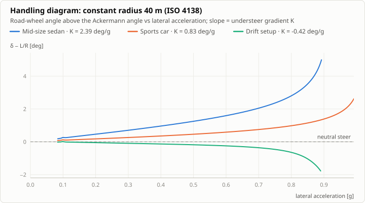
</picture>
<sub><b>조향 특성 선도 (ISO 4138)</b><br>기울기가 언더스티어 구배, 음의 기울기는 오버스티어</sub>
</td>
</tr>
<tr>
<td align="center">
<picture>
  <source media="(prefers-color-scheme: dark)" srcset="docs/figures/gain-dark.svg">
  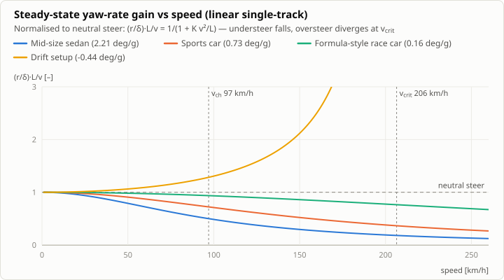
</picture>
<sub><b>속도별 요 레이트 이득</b><br>특성속도 v<sub>ch</sub>, 오버스티어 차량의 임계속도 v<sub>crit</sub></sub>
</td>
<td align="center">
<picture>
  <source media="(prefers-color-scheme: dark)" srcset="docs/figures/bode-dark.svg">
  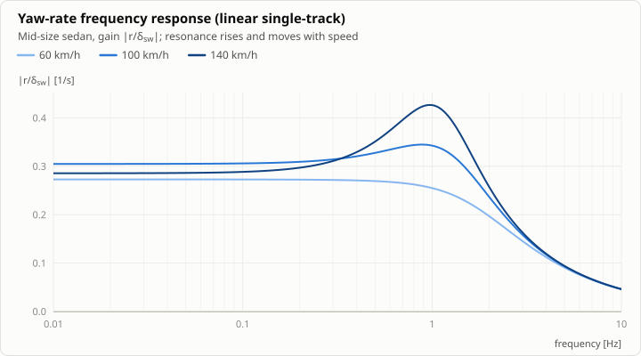
</picture>
<sub><b>요 레이트 주파수 응답</b><br>속도가 오를수록 공진이 커지고 이동</sub>
</td>
</tr>
<tr>
<td align="center">
<picture>
  <source media="(prefers-color-scheme: dark)" srcset="docs/figures/swd-dark.svg">
  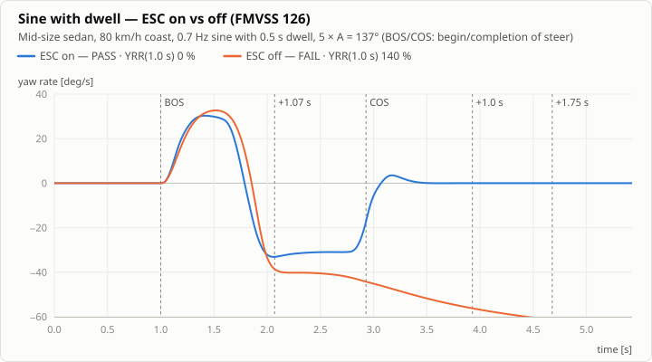
</picture>
<sub><b>사인 위드 드웰 (FMVSS 126)</b><br>ESC 끔: 스핀(불합격), ESC 켬: 수렴(합격)</sub>
</td>
<td align="center">
<picture>
  <source media="(prefers-color-scheme: dark)" srcset="docs/figures/dlc-dark.svg">
  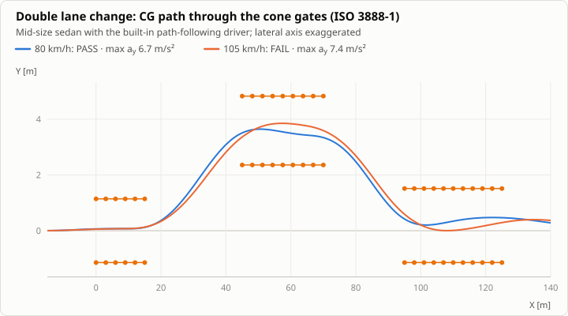
</picture>
<sub><b>더블 레인 체인지 (ISO 3888-1)</b><br>경로 추종 운전자 모델과 콘 경계 판정</sub>
</td>
</tr>
<tr>
<td align="center">
<picture>
  <source media="(prefers-color-scheme: dark)" srcset="docs/figures/tire-dark.svg">
  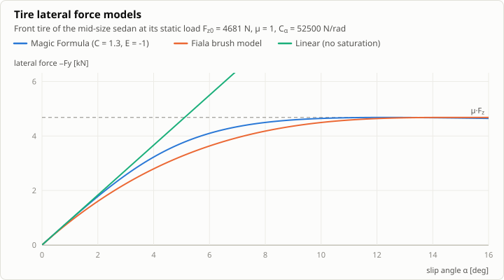
</picture>
<sub><b>타이어 모델</b><br>Magic Formula·Fiala는 μF<sub>z</sub>에서 포화, 선형은 검증용</sub>
</td>
<td align="center">
<picture>
  <source media="(prefers-color-scheme: dark)" srcset="docs/figures/verify-dark.svg">
  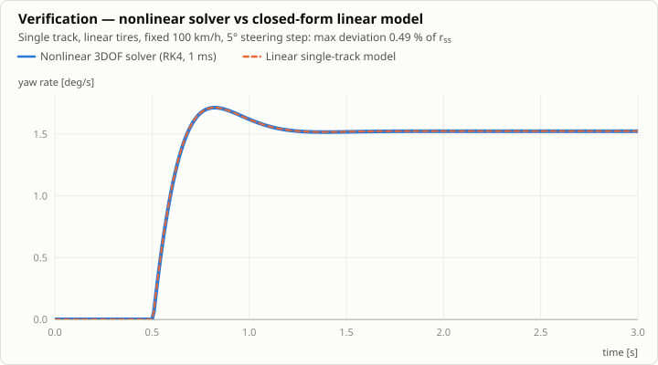
</picture>
<sub><b>검증</b><br>선형 조건에서 비선형 솔버와 해석해가 겹침</sub>
</td>
</tr>
</table>

## 프리셋 벤치마크

내장 프리셋 7종을 기본 설정(Magic Formula 타이어, 이중 트랙, 건조 노면 μ 1.0, 프리셋별 ABS·TCS·ESC)으로 계산한 결과입니다. 이 표도 `npm run docs`로 다시 생성됩니다.

<!-- generated:benchmark -->
| 프리셋 | m [kg] | K [deg/g] | v<sub>ch</sub> [km/h] | f<sub>n</sub> [Hz] | ζ | T<sub>r90</sub> [s] | A [deg] | a<sub>y,max</sub> [g] | FMVSS 126 | ISO 3888-1 @80 | 100→0 [m] | 0→100 [s] |
| --- | ---: | ---: | ---: | ---: | ---: | ---: | ---: | ---: | ---: | ---: | ---: | ---: |
| 중형 세단 | 1,600 | 2.21 | 97 | 1.29 | 0.73 | 0.132 | 27.4 | 0.91 | ✅ | ✅ | 45.5 | 6.6 |
| SUV | 2,150 | 2.22 | 98 | 1.02 | 0.72 | 0.143 | 30.0 | 0.82 | ✅ | ✅ | 47.8 | 6.4 |
| 스포츠카 | 1,450 | 0.73 | 157 | 1.34 | 0.85 | 0.131 | 15.8 | 1.01 | ✅ | ✅ | 41.2 | 4.8 |
| 포뮬러형 레이싱카 | 700 | 0.16 | 372 | 3.00 | 0.98 | 0.067 | 11.0 | 2.00 | ✅ | ✅ | 25.2 | 2.7 |
| 드리프트 세팅 | 1,350 | −0.44 | 206 (v<sub>crit</sub>) | 0.79 | 1.15 | 0.366 | 12.7 | 0.89 | ❌ | ❌ | 45.1 | 7.5 |
| 소형 트럭·밴 (3.5 t) | 3,500 | 1.53 | 132 | 0.54 | 0.80 | 0.198 | 37.8 | 0.72¹ | ✅ | ❌ | 50.1 | 13.2 |
| 시내버스 | 12,500 | 1.72 | 158 | 0.34 | 0.86 | 0.451 | 62.8 | 0.60¹ | n/a | ❌ | 55.7 | - |
<!-- /generated:benchmark -->

<details>
<summary><b>항목별 조건</b></summary>

<br>

| 항목 | 조건 |
| --- | --- |
| K, v<sub>ch</sub>, f<sub>n</sub>, ζ | 선형 단일 트랙 이론, f<sub>n</sub>과 ζ는 100 km/h 기준 |
| T<sub>r90</sub> | ISO 7401 스텝 조향, 80 km/h, 정상 횡가속도 4 m/s² |
| A | SIS 시험의 0.3 g 조향휠각 |
| a<sub>y,max</sub> | ISO 4138 정상원(R 40 m) 지속 최대 횡가속도 |
| FMVSS 126 | 5A 진폭. 차량 총중량 4,536 kg 초과 차량은 적용 대상이 아님(n/a) |
| ISO 3888-1 | 진입 속도 80 km/h |
| 100→0 | ABS 직진 제동거리 |
| 0→100 | 최고속도 제한이 100 km/h 이하이면 `-` |
| ¹ | 한계 전에 바퀴 들림(전복 위험) 경고가 발생. 평면 모델이므로 이후 값은 참고용 |

</details>

## 모델 개요

MathWorks Vehicle Dynamics Blockset의 *Vehicle Body 3DOF*(이중/단일 트랙)와 같은 운동방정식을 바탕으로 다음을 추가했습니다.

| 구성 요소 | 내용 |
| --- | --- |
| 타이어 | Magic Formula(기본), Fiala 브러시, 선형. 코너링 강성·마찰계수의 하중 민감도, 이완 길이 |
| 하중이동 | 종방향(피치)과 횡방향(롤 강성 배분 LLTD), 1차 지연, 공력 다운포스 |
| 종·횡 결합 | 마찰 타원 복합 슬립, 바퀴 잠김·휠스핀 상태, 오픈 디퍼렌셜 |
| 전자 제어 | ABS(전륜 개별 + 후륜 select-low), TCS, ESC(요 레이트 추종, 개별 제동·감압) |
| 구동·제동 | 출력 제한, 구동 배분, 제동 배분, 주차 브레이크, 항력·구름저항 |
| 운전자 | 곡률 피드포워드 + 전방 주시 횡오차 피드백, 신경근 지연 |
| 수치 해법 | 고정 간격 RK4(기본 1 ms), 저속 특이점 처리, 바퀴 들림 경고 |

한 적분 간격 안의 계산 흐름은 다음과 같습니다.

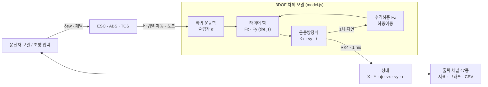

자세한 수식과 가정은 앱의 **이론·문서** 탭과 [docs/MODEL.md](docs/MODEL.md)에 있습니다. MATLAB 블록과 같은 결과를 얻으려면 타이어 모델 "선형", `nC = 1`, `kμ = 0`, 전축 LLTD 50 %로 설정하십시오.

## 프로젝트 구조

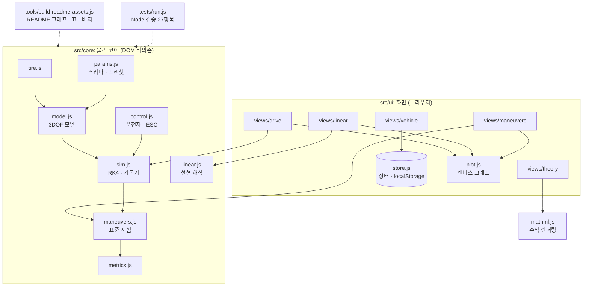

| 경로 | 내용 |
| --- | --- |
| `index.html` | 앱 진입점 |
| `assets/css/app.css` | 디자인 토큰(라이트/다크)과 레이아웃 |
| `src/core/` | 물리 코어. DOM에 의존하지 않아 Node에서 그대로 실행 |
| `src/ui/` | 화면: dom · store · plot · forms · diagram · mathml · app, `views/` |
| `tests/` | 검증 묶음 (`npm test`) |
| `tools/` | README 자산 생성기 (`npm run docs`) |
| `docs/` | 모델·검증 문서, 그래프, 배지, 스크린샷 |
| `legacy/` | 통합 이전의 두 프로그램 (참고용) |

## 검증

물리 코어는 DOM 없이 Node.js에서도 그대로 실행되며, 의존성 없는 검증 묶음이 포함되어 있습니다.

```bash
npm test
```

| 분류 | 확인 내용 | 허용 오차 |
| --- | --- | --- |
| 선형 이론 | 비선형 단일 트랙(선형 타이어, 속도 고정) vs 해석해 정상 이득 | 0.3 % |
| 선형 이론 | 스텝 응답 시간 이력 vs 선형 모델 | RMS 1 % |
| MATLAB 등가성 | 이중 트랙(n<sub>C</sub> = 1, LLTD 50 %) = 단일 트랙 | 1 % |
| 안정성 | 이득 최대점 = v<sub>ch</sub>, v<sub>crit</sub> 전후 안정성 전환 | 1 % |
| 타이어 | MF 원점 기울기 = C<sub>α</sub>, 최대 횡력 = μF<sub>z</sub> | 0.01 % |
| 종방향 | 타력 감속 = 항력 + 구름저항, ABS MFDD ≈ ημg | 1 % / 0.88~0.95 g |
| 시험 판정 | FMVSS 126 합격/불합격, ISO 3888 치수, 바퀴 들림 경고, μ-split 안정성 | - |
| 입력 방어 | 매개변수 범위 보정, 조향 표 파서 | - |

전체 27개 항목은 [docs/VALIDATION.md](docs/VALIDATION.md)에 있습니다.

> [!IMPORTANT]
> 실차 측정 데이터와의 정량 검증은 포함되어 있지 않습니다. 실무에 적용하기 전에 대상 차량의 측정값으로 코너링 강성·요 관성·롤 강성 배분을 보정하십시오.

## 데이터 형식

| 형식 | 내용 | 비고 |
| --- | --- | --- |
| 차량 JSON (`*.vehicle.json`) | `{ format: "vd-workbench/vehicle", version, name, params }` | 가져올 때 알 수 없는 키는 버리고 범위 밖 값은 보정 |
| 실행 JSON (`*.run.json`) | 조건, 설정, 지표, 전체 시계열 | [시험 해석]에서 다시 가져와 비교 가능 |
| CSV | 첫 행이 `채널 [단위]` 머리글인 UTF-8(BOM) | Excel, MATLAB `readtable`에서 바로 읽힘 |
| MATLAB `.m` | `veh.Mass`, `veh.Cy_f` 등 차량 구조체 | Vehicle Body 3DOF 매개변수 대응 주석 포함 |

> [!NOTE]
> 모든 데이터는 사용자의 브라우저 안에서만 처리되며 네트워크로 전송되지 않습니다(CSP `connect-src 'none'`). 저장 기능은 브라우저의 localStorage를 사용합니다.

## 적용 범위와 한계

- 롤·피치·바퀴 회전 자유도가 없습니다(준정적 근사).
- 서스펜션 기구학·컴플라이언스·캠버·얼라이닝 토크는 등가 코너링 강성에 포함된 것으로 봅니다.
- 노면은 평탄하며 전복은 표현하지 않습니다(바퀴 들림 경고만 표시).
- 운전자 모델은 재현성 있는 비교를 위한 것으로, 인간 운전자의 한계 성능을 대표하지 않습니다.
- ISO 3888 오프셋 기준선과 FMVSS 126 GVWR 처리는 표준 해석상의 가정이며 앱 문서에 명시했습니다.
- 프리셋은 대표값이며 특정 양산 차량의 데이터가 아닙니다.

## 레거시 프로그램과의 관계

`legacy/` 폴더의 두 프로그램을 통합·재구성했습니다.

| 레거시 | 통합 후 | 주요 변화 |
| --- | --- | --- |
| *Vehicle Dynamics 2D Car Sim* | 실시간 주행 | 임의 계수 기반 물리(횡력 반력 0.4배 등)를 3DOF 이중 트랙 모델로 교체, 프리셋·ABS/TCS·노면·타이어 매개변수화 |
| *Vehicle Dynamics 3DOF Sim* | 시험 해석 · 선형 해석 | 오일러 적분 단일 시험을 RK4 기반 표준 시험 11종과 선형 해석으로 확장, CDN(React·Babel·Chart.js) 의존성 제거 |

## 개발

```bash
npm test        # 물리 코어 검증 (27항목)
npm run docs    # README 그래프 · 벤치마크 표 · 배지 다시 생성
```

외부 패키지는 쓰지 않으며 Node.js 18 이상이면 됩니다.

- 저장소를 GitHub에 올리면 `.github/workflows/test.yml`이 push·PR마다 검증 묶음을 실행합니다.
- 상단 배지는 외부 배지 서비스 없이 `docs/badges/`에 생성되는 로컬 SVG입니다. `tests` 배지는 `npm run docs` 실행 시점의 결과를 반영합니다.
- 결과 그래프는 `docs/figures/`에 라이트·다크 두 벌로 생성되며, README는 `<picture>`로 GitHub 테마에 맞는 쪽을 보여 줍니다. 물리 모델이나 프리셋을 바꾼 뒤에는 `npm run docs`로 그래프·표·배지를 함께 갱신하십시오.

## 라이선스

[MIT](LICENSE)

---

## English

**Vehicle Dynamics Workbench** is a planar three-degree-of-freedom vehicle dynamics application: standardised handling tests (ISO 7401, ISO 4138, ISO 3888-1/-2, FMVSS 126 sine-with-dwell, NHTSA SIS, braking incl. μ-split), linear single-track stability and frequency-response analysis, and a real-time driving simulator, all in one static web app with no server and no third-party libraries. The interface is bilingual (Korean/English) with light and dark themes.

| | |
| --- | --- |
| **Model** | Equations of MathWorks *Vehicle Body 3DOF* (dual/single track) extended with Magic Formula and Fiala tires, load sensitivity, lateral load transfer with LLTD, combined slip, ABS (rear select-low), TCS, ESC, driveline and brakes, aerodynamics and a path-following driver; fixed-step RK4 at 1 ms |
| **Run** | Open `index.html`, serve the folder with any static server, or publish it with GitHub Pages (root of the default branch) |
| **Verify** | `npm test` runs 27 dependency-free checks: nonlinear vs closed-form linear results, MATLAB 3DOF equivalence, tire limits, braking physics, FMVSS 126 verdicts, parser hardening |
| **Figures** | The charts and the preset benchmark above are computed by the same physics core; `npm run docs` regenerates them |
| **Data** | Vehicle JSON, run JSON (re-importable), CSV time series, MATLAB `.m` parameter export. Everything stays in the browser |
| **Docs** | Equations, assumptions, procedures, verification and references are in the in-app *Theory* tab and in [docs/MODEL.md](docs/MODEL.md) |

Licensed under the [MIT License](LICENSE).
